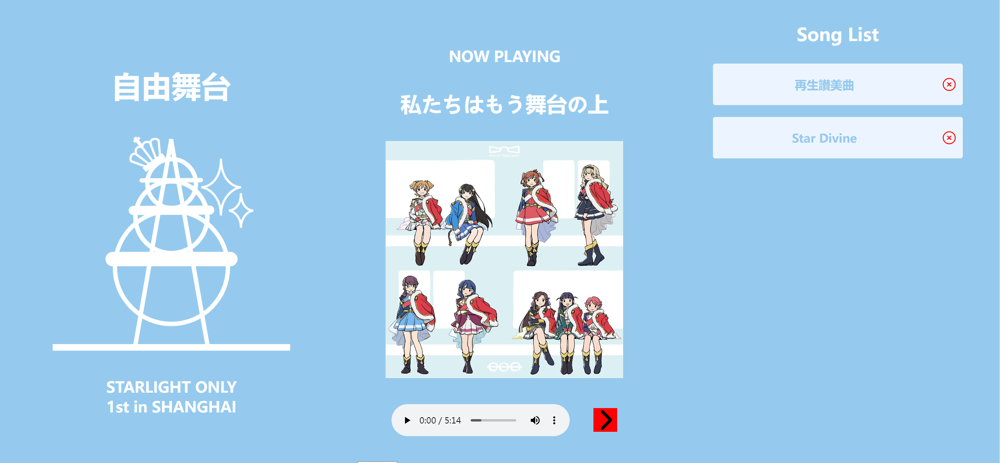

## 功能

在控制页面中选中歌曲后经本地服务器转发实时显示在展示页面中。展示页面对列表中的歌曲自动联播。

展示页面


控制页面


## 部署

编译和运行需要NodeJS和Python环境。

### 准备歌曲数据库

项目使用SQLite数据库存储歌曲数据，包含两个表`albums`和`songs`，结构为

```sql
CREATE TABLE IF NOT EXISTS albums
    (id INTEGER PRIMARY KEY AUTOINCREMENT,
    name UNIQUE, cover_path TEXT)

CREATE TABLE IF NOT EXISTS songs
    (id INTEGER PRIMARY KEY AUTOINCREMENT,
    title TEXT, artist TEXT, path TEXT,
    album_id INTEGER, FOREIGN KEY(album_id) REFERENCES albums(id))
```

其中路径（`albums`的`cover_path`列和`songs`的`path`列）为媒体文件相对本地某个根目录或媒体服务器上的相对路径。

### 编译前端页面

首先，安装Node依赖

```
cd free-stage
npm install
```

编译页面
```
npm run build
```

### 运行后端服务器

安装Python依赖

```
pip install -r requirements.txt
```

运行FastAPI服务器

```
fastapi run --host 127.0.0.1 --port 8080 server/server.py
```

端口可以任选，注意和下面的Nginx配置保持一致。

### 配置Nginx

编辑`nginx.conf`，修改URL路径`/`、`/display/`、`/content/`下的根路径到本地相应的路径。编辑`/api/`的`proxy_pass`为FastAPI服务器的路径。